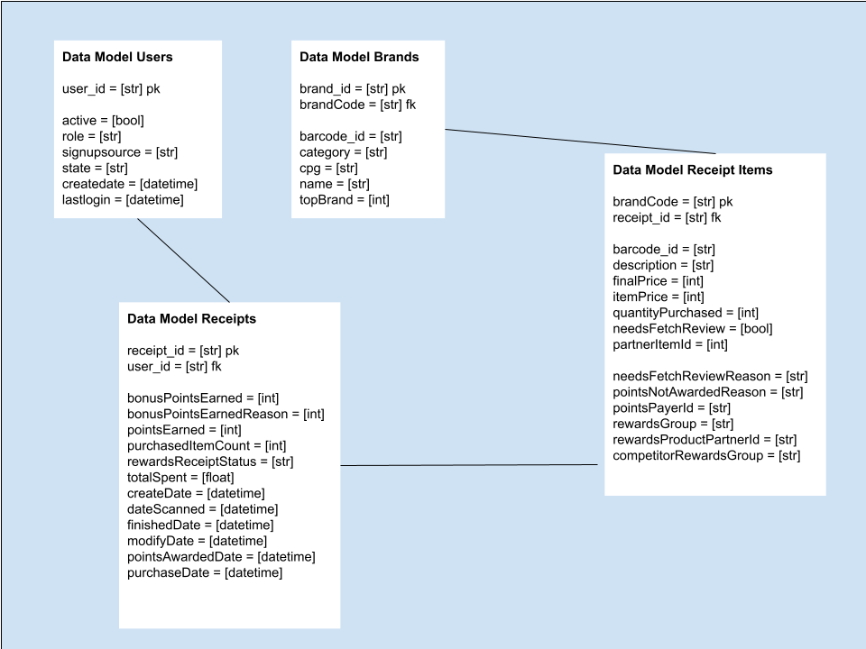
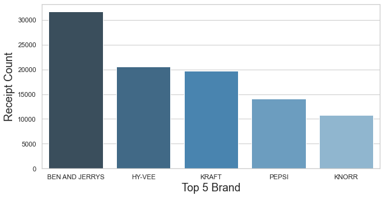
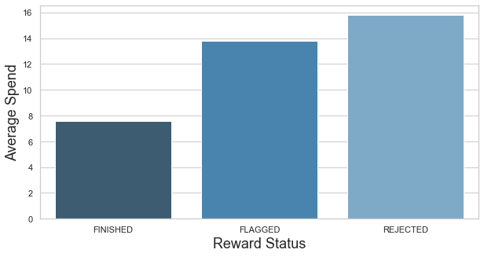
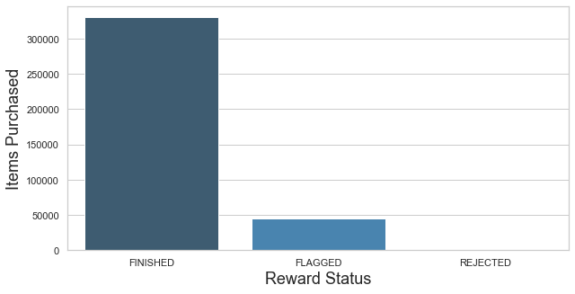
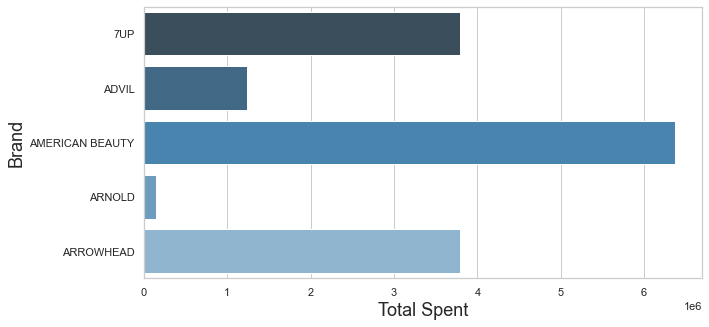

# Fetch Rewards Coding Data Analyst
Analyze and Answer Business Questions

I will be giving information on our current data and what we observed from the analysis. 

Fetch Rewards Data Structure: 

#  Business Questions and Answers
- *Check data_query notebook for queries*

### Question 1: What are the top 5 brands by receipts scanned for most recent month?

### Question 2: What are the top 5 brands by receipts scanned for most recent month?

### Question 4: What are the top 5 brands by receipts scanned for most recent month?

### Question 5: What are the top 5 brands by receipts scanned for most recent month?

# Data Quality 
- *Check data_quality notebook for queries*

We have a nested dictionary in rewards Receipt Items List
this can slow down data cleaning espescially when the receipt item does not have a 
corresponding id to properly show which users receipt item that was.

Purchased Date show NAT could cause an issue if we do want to ever do any time series
analysis on the data . 

With barcode and description not being represented this can cause issues because we would be 
missing out on valuable data that could shift how we move forward with our customers

